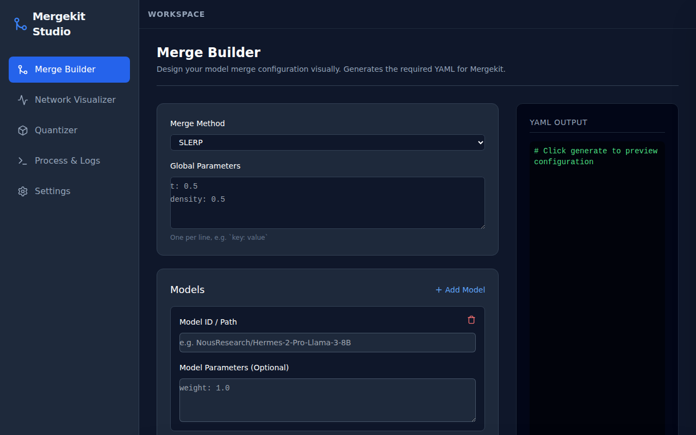

# Mergekit Studio

Mergekit Studio is a powerful, local UI for [mergekit](https://github.com/arcee-ai/mergekit) and [llama.cpp](https://github.com/ggerganov/llama.cpp). It allows you to visually build model merge configurations, check model architecture compatibility via HuggingFace, and execute the merge. After merging, you can seamlessly convert models to `F16 GGUF` and quantize them (e.g., `Q4_K_M`) for immediate use in LM Studio.

## Features

- **Merge Builder:** Visually create `mergekit` YAML configurations. Supports popular methods like SLERP, TIES, DARE, and Passthrough.
- **Network Visualizer:** Query the HuggingFace API to fetch the architecture of base models (without downloading weights!) to visually verify layer counts, hidden sizes, and compatibility before attempting a merge.
- **Quantizer:** Convert your merged HuggingFace model into F16 GGUF, and then quantize it using `llama.cpp` to save memory and increase inference speed.
- **Process & Logs:** Stream terminal output in real-time as your jobs (merges, conversions, quantizations) run in the background.

## Interface Screenshots

### Merge Builder


## Setup & Installation

**Prerequisites:** You must have Python 3 and Node.js installed on your system.

1. Clone this repository.
2. Run the automated setup script to install all backend/frontend dependencies, and clone/compile `llama.cpp` and `mergekit`:
   ```bash
   chmod +x setup.sh
   ./setup.sh
   ```

## Running the Application

You must run both the backend and frontend servers simultaneously.

**Start the Backend (FastAPI)**
```bash
cd backend
source venv/bin/activate
uvicorn main:app --reload --host 0.0.0.0 --port 8000
```

**Start the Frontend (React + Vite)**
```bash
cd frontend
npm run dev
```

Open your browser to `http://localhost:5173` to start using Mergekit Studio!

## License
MIT License
